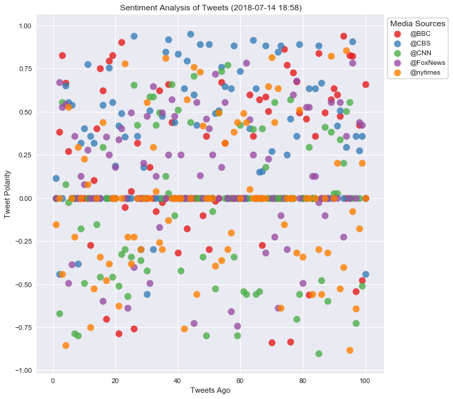
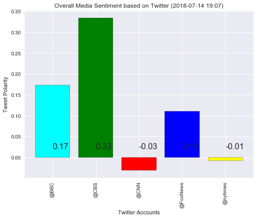

# Media Sentiment Analsis

### Analysing 100 Last Tweet from Five Major Media

#### 1.	After plotting 500 tweets (each media 100), I found CBS (blue points) are mostly falling under positive compound range, but there are not significant pattern we can find for other media, since the compound score all spread widely from -1 to 1.

#### 2.	According to Overall Media Sentiment Bar Chart, BBC, FoxNes and CBS has higher Compound Rate (from 0.1 to 0.33), compare to CNN, NY Times, whose tone are more neutral (Compound Rate around or slightly under 0).

#### 3.	However, any observation based on current data could be not accurate, since the tone of last 100 tweet varied during time to time. Especially, if there is a major event happens during this time frame, the sentiment could be very similar.


```python
# Dependencies
import tweepy
import numpy as np
import pandas as pd
from datetime import datetime
import matplotlib.pyplot as plt
from matplotlib import style
import json
import seaborn as sns

style.use('ggplot')

# Import and Initialize Sentiment Analyzer
from vaderSentiment.vaderSentiment import SentimentIntensityAnalyzer
analyzer = SentimentIntensityAnalyzer()

# Twitter API Keys
from config import (consumer_key, 
                    consumer_secret, 
                    access_token, 
                    access_token_secret)

# Setup Tweepy API Authentication
auth = tweepy.OAuthHandler(consumer_key, consumer_secret)
auth.set_access_token(access_token, access_token_secret)
api = tweepy.API(auth, parser=tweepy.parsers.JSONParser())
```


```python
# Target Account
target_user = ("@BBC", "@CBS", "@CNN", "@FoxNews", "@nytimes")

# Variables for holding sentiments
sentiments = []

# Target User Account
for target in target_user:

    # Counter
    counter = 1

    # Variable for max_id
    oldest_tweet = None

    # Loop through 5 pages of tweets (total 100 tweets)
    for x in range(5):

        # Get all tweets from home feed
        public_tweets = api.user_timeline(target, max_id = oldest_tweet)

        # Loop through all tweets 
        for tweet in public_tweets:

            # Print Tweets
            # print("Tweet %s: %s" % (counter, tweet["text"]))

            # Run Vader Analysis on each tweet
            results = analyzer.polarity_scores(tweet["text"])
            compound = results["compound"]
            pos = results["pos"]
            neu = results["neu"]
            neg = results["neg"]
            tweets_ago = counter

            # Get Tweet ID, subtract 1, and assign to oldest_tweet
            oldest_tweet = tweet['id'] - 1

            # Add sentiments for each tweet into a list
            sentiments.append({"User": target,
                                "Date": tweet["created_at"], 
                               "Compound": compound,
                               "Positive": pos,
                               "Negative": neu,
                               "Neutral": neg,
                               "Tweets Ago": counter})

            # Add to counter 
            counter += 1

# Convert sentiments to DataFrame
sentiments_pd = pd.DataFrame.from_dict(sentiments)
sentiments_pd.head()

# Export df to csv
sentiments_pd.to_csv('Output/Tweet_Sentiment.csv')

```

## Twitter Sentiment Analysis for News Account


```python
# Set seaborn format
sns.set()
#x='x', y='y', data=df
# Create a scarlett plot showing the compond rate of last 100 tweet of seleted tweet account
sns.lmplot(x = "Tweets Ago", y = "Compound", data = sentiments_pd, fit_reg=False, hue='User', markers='o', palette="Set1", legend=False, size=8, scatter_kws={"s": 100} )

# Set legend out of plot area and one the right up cornor
plt.legend(bbox_to_anchor=(1.05, 1), loc=2, borderaxespad=0.)

# Incorporate the other graph properties
now = datetime.now()
now = now.strftime("%Y-%m-%d %H:%M")
plt.title(f"Sentiment Analysis of Tweets ({now})")
plt.ylabel("Tweet Polarity")
plt.xlabel("Tweets Ago")
plt.legend(bbox_to_anchor = (1,1),
           frameon = True, 
           edgecolor = 'black', 
           facecolor = 'white',
           title = "Media Sources")
# save as out put
plt.savefig('Output/Tweet_Sentiment.png', bbox_inches = 'tight')
plt.show()
```





## Overall Media Twitter Sentiment by Account


```python
# calculate average point for each taster and put that in to a df
mean_point = pd.DataFrame(sentiments_pd.groupby(["User"])["Compound"].mean())
# Reset Index to make "User" as a column
mean_point = mean_point.reset_index()

# Export df to csv
mean_point.to_csv('Output/Mean_Sentiment.csv')


#set seaborn format
sns.set()

# Create a bar chart showing the mean compond rate of each user
mean_point.plot(x = "User", y="Compound", kind="bar", width = 0.8, color=['cyan', 'green', 'red', 'blue', 'yellow'], figsize = (8,6), grid="True", edgecolor='black', legend=False)


# Incorporate the other graph properties
now = datetime.now()
now = now.strftime("%Y-%m-%d %H:%M")
plt.title(f"Overall Media Sentiment based on Twitter ({now})")
plt.ylabel("Tweet Polarity")
plt.xlabel("Twitter Accounts")

# Create labels
label = mean_point["Compound"].round(2)

# Text on the top of each barplot
for i in range(5):
    plt.text(x = i , y = 0.02, s = label[i], size = 16)
 

# save as out put
plt.savefig('Output/Mean_Sentiment.png', bbox_inches = 'tight')

plt.show()


```




